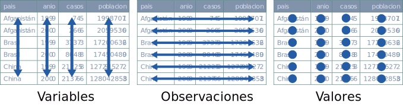

 


```{css my-header-colors, echo = FALSE}

.entry-image {
  min-height: 300px;
  background-image: linear-gradient(to right, #c1ecda, #b92675);
}

```


```{r setup, include=FALSE}
knitr::opts_chunk$set(echo = TRUE, warning = FALSE, message = FALSE)

library(prettydoc)


```

## ¿Cómo ordenamos la información en una base de datos?

Hablamos de datos ordenados cuando:



-   Cada variable está ubicada en una columna.
-   Cada observación en una fila.
-   Cada valor en una celda.

R cuenta con una serie de paquetes que proporcionan funciones que facilitan el trabajo con este tipo de datos.

**dplyr** permite:

1.  Seleccionar las variables que nos interesan.
2.  Seleccionar observaciones.
3.  Crear nuevas variables.
4.  Resumir datos y extraer información.
5.  Ordenar los datos.

## Encuesta para gente joven

A continuación, vamos a trabajar con una encuesta administrada en 2013 a 674 jóvenes del Reino Unido con preguntas acerca de distintos aspectos de su vida.


### Cargar la base e inspeccionar las variables

```{r datos, message=FALSE}

# Cargá el paquete tidyverse. Este incluye a dplyr.

# Importar base de datos encuesta_joven.csv

# Inspeccionar la base


```

### Las pipelines o tuberías

El operador pipe ( %\>% ) es una herramienta que se utiliza para encadenar una secuencia de operaciones sobre una misma base de datos.

## Funciones o verbos que pueden encadenarse con %\>%

-   ***select()*** selecciona variables.
-   ***filter()*** selecciona observaciones.
-   ***mutate()*** crea nuevas variables.
-   ***summarise()*** extrae información no presente en la base.
-   ***arrange()*** ordena los datos.
-   ***count()*** cuenta cuantas observaciones caen dentro de cada grupo.
-   ***ggplot()*** para generar gráficos

### Edad de los participantes

```{r describir-edad}

# contar cuantas participantes hay de cada edad


```

### Nivel educativo de los participantes

```{r describir-educacion}

# contar cuantas participantes hay de cada nivel educativo


```


### Género de los participantes según la edad

```{r describir-sexo}

encuesta %>% 
  count(demo_gender, demo_age) %>% 
  ggplot(aes(demo_age, n, fill = demo_gender)) +
  geom_bar(stat = "identity", position = "dodge")


encuesta %>%
  group_by(demo_gender, demo_age) %>%
  summarise(n = n()) %>%
  mutate(freq = n / sum(n)) %>% 
  ggplot(aes(demo_age, freq, fill = demo_gender)) +
  geom_bar(stat = "identity", position = "dodge")


```

### Hábito de fumar en relación al género

```{r fumar}


```


### Hábitos saludables según edad (de menores de 21 años) y género

```{r habitos_saludables}


```

### Consumo de alcohol en jóvenes de entre 18 y 25 años.

```{r alcohol}


```


### Relación entre peso y altura según consumo de alcohol

```{r personalidad}


```


### Asociación entre rasgos de personalidad

```{r personalidad2}

```


### Estilos de música por género

```{r musica}


```

